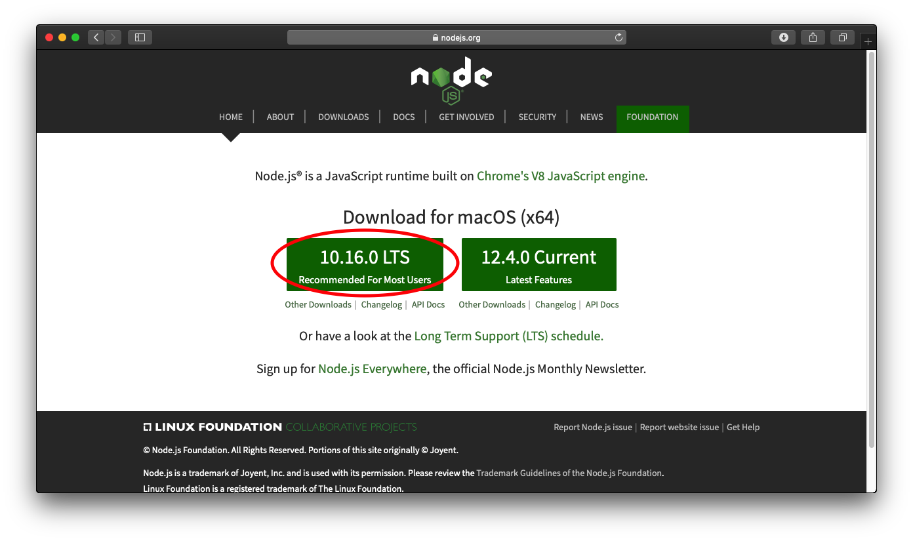

# NUS Students' Sports Club Website

This repository contains the code for NUS Students' Sports Club Website. It is coded using React-Redux with the help of Node.js

## Table of Contents
1. [Running the Application on your computer](#running-the-application-on-your-local-machine)
    1. [Install Node.js](#install-Node.js)
    2. [Downloading the Application](#downloading-the-application)
    3. [Downloading for Testers](#downloading-for-testers)
    4. [Cloning for Developers](#cloning-for-developers)
    5. [Committing for Developers](#committing-for-developers)
    6. [Running the Application](#running-the-application)
2. [File Structure](#structure)
3. [Testing](#testing)
4. [Logging](#logging)
5. [Acknowledgements](#acknowledgements)

## Running the Application on your Computer
### Install Node.js
Install Node.js by going to the following [website](https://nodejs.org/en/ "Node.js Homepage") and __download the LTS version__.




After installing Node.js, check that everything has been installed correctly, open the terminal application and type in the following:

```
node -v
```

If you see it return the version number `10.16.0`, all is well.

### Downloading the Application
#### Downloading for Testers
1. Download the [repository](https://github.com/yongchenglow/nus-students-sports-club/archive/master.zip)
2. Unzip the file in your desired location

#### Cloning for Developers
1. Download git for [mac](https://git-scm.com/download/mac) or [windows](https://git-scm.com/download/win) and install it
2. Create a [github account](https://github.com/join)
3. Navigate to the folder on where you want to store your computer
4. Open Terminal(Mac) or Cmd(windows)
5. Type
```
cd<space>
```
6. Drag the folder into the Terminal
7. Press the `enter` key
8. Type the following into the Terminal
```
 git clone https://github.com/yongchenglow/nus-students-sports-club.git
```

#### Committing for Developers
1. Download [atom](https://atom.io) and install it
2. Launch Atom
3. Drag the folder you have just cloned into atom
4. Make the necessary changes
5. On the bottom right of Atom click on the word `Git`
6. Stage all the changes by clicking the `Stage All` button near the top
7. Write a commit message by describing the changes you have made
8. Click on `commit to master`


### Running the Application
1. Open Terminal(Mac) or Cmd(windows)
2. Type
```
cd<space>
```
3. Drag the folder into the Terminal
4. Press the `enter` key
5. Run the following commands
```
npm install
npm start
```
6. By default you should be able to access the website on your localhost [http://localhost:3000/](http://localhost:3000/ )

## File Structure
```
nus-students-sports-club
└── src
    ├── actions
    ├── components
    │    ├── main
    │    │    ├── home (www.nussportsclub.org)
    │    │    │    ├── member club (e.g. www.nussportsclub.org/aerobics)
    │    │    │    │    ├── images
    │    │    │    │    └── infomation.json
    │    │    │    ├── template.js    
    │    │    │    └── router.js
    │    │    └── others (www.nussportsclub.org/nusbiathlon)
    │    ├── year (e.g. 2019)
    │    └── router.js
    ├── images
    │    └── image group
    │        ├── image file
    │        └── image file.js
    └── reducers
```
## Testing
Testing in this app is done using Jest, to write test cases you may refer to their [docs](https://jestjs.io/docs/en/getting-started)

In order to run the test, type the following commands in terminal:
```
npm test
```

Please write relevant test cases if you are developing!

## Logging
Logging is done using a custom logger file with the help of [npm debug](https://www.npmjs.com/package/debug). All logs will be removed during the production build.

3 Different kinds of logs will be present throughout the code:
1. Log.info() in lightblue
2. Log.warning() in orange
3. Log.error() in red


To write logs:
1. Import the log file into the document (located in the src folder)
2. Use the correct log depending on the information

## Acknowledgements
1. This project was bootstrapped with [Create React App](https://github.com/facebook/create-react-app).
2. Logging system is created with the help of [this article](https://levelup.gitconnected.com/step-up-your-console-messaging-game-in-your-react-app-42eee17659ec)
