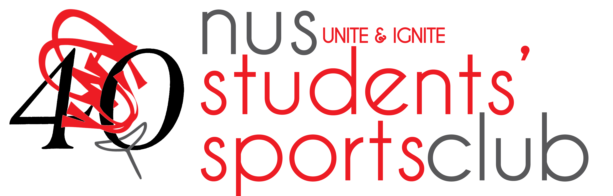

# NUS Students' Sports Club Website


This repository contains the code for NUS Students' Sports Club Website.

## Table of Contents

1. [Running the Application on your computer](#running-the-application-on-your-local-machine)
   1. [Install Node.js](#install-Node.js)
   2. [Downloading the Application](#downloading-the-application)
   3. [Downloading for Testers](#downloading-for-testers)
   4. [Cloning for Developers](#cloning-for-developers)
   5. [Committing for Developers](#committing-for-developers)
   6. [Running the Application](#running-the-application)
2. [File Structure](#structure)
3. [Testing](#testing)
4. [Logging](#logging)
5. [Acknowledgements](#acknowledgements)
6. [License](#license)

## Running the Application on your Computer

### Install Node.js

Install Node.js by going to the following [website](https://nodejs.org/en/ 'Node.js Homepage') and **download the LTS version**.


After installing Node.js, check that everything has been installed correctly, open the terminal application and type in the following:

```
node -v
```

If you see it return the version number `16.14.0`, all is well.

### Downloading the Application

#### Downloading for Testers

1. Download the [repository](https://github.com/yongchenglow/nus-students-sports-club/archive/master.zip)
2. Unzip the file in your desired location

#### Cloning for Developers

1. Download git for [mac](https://git-scm.com/download/mac) or [windows](https://git-scm.com/download/win) and install it
2. Create a [github account](https://github.com/join)
3. Navigate to the folder on where you want to store your computer
4. Open Terminal(Mac) or Cmd(windows)
5. Type

```
cd<space>
```

6. Drag the folder into the Terminal
7. Press the `enter` key
8. Type the following into the Terminal

```
 git clone https://github.com/yongchenglow/nus-students-sports-club.git
```

#### Committing for Developers

1. Download [Visual Studio Code](https://code.visualstudio.com/download) and install it
2. Launch Visual Studio Code(VSCode)
3. Drag the folder you have just cloned into VSCode
4. Install the plugins
5. Make the necessary changes
6. Find the `source control` tab in VSCode on the toolbar on the left
7. Stage all the changes by clicking the `+` button on the right hand side of the word changes
8. You should see the files moved under the Staged Changes tab
9. Write a commit message by describing the changes you have made
10. Click on `commit to master`

### Running the Application

1. Open Terminal(Mac) or Cmd(windows)
2. Type

```
cd<space>
```

3. Drag the folder into the Terminal
4. Press the `enter` key
5. Run the following commands

```
npm install
npm start
```

6. By default you should be able to access the website on your localhost [http://localhost:3000/](http://localhost:3000/)

## File Structure

```
nus-students-sports-club
├── src
│   └─── components
│         ├── 39 (39th MC Webpage)
│         └── home
│              └── pages
│                   ├── ifg
│                   ├── main
│                   ├── nusbiathlon
│                   ├── runnus
│                   └── sunnus
└── public
     ├── data
     │    ├── 39 (39th MC Webpage)
     │    └─── memberClubs
     ├── elections
     ├── ifg
     ├── images
     ├── main
     │    ├── 39
     │    ├── 40
     │    ├── 41
     │    └── current
     ├── nusbiathlon
     ├── runnus
     └── sunnus

## Testing

Testing in this app is done using Jest, to write test cases you may refer to their [docs](https://jestjs.io/docs/en/getting-started)

In order to run the test, type the following commands in terminal:

```

npm test

```

## Acknowledgements

1. This project was bootstrapped with [Create React App](https://github.com/facebook/create-react-app).

## License

[GNU GENERAL PUBLIC LICENSE](./LICENSE)
```
